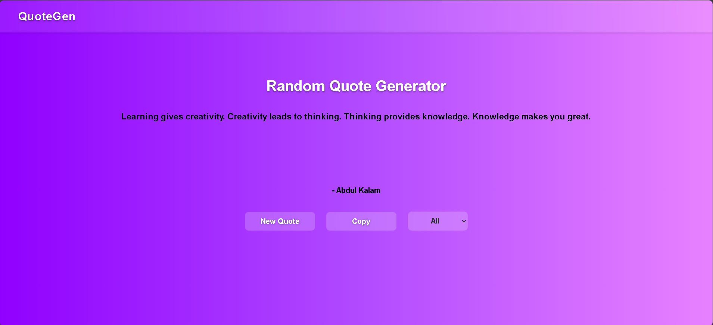

# 🌟 Random Quote Generator

A beautiful and responsive Random Quote Generator website built using HTML, CSS, and JavaScript.  
This project fetches random quotes from an API and displays them with dynamic gradient backgrounds.

---

## 🚀 Features

✅ Generate random quotes  
✅ Fetch quotes using API  
✅ Responsive design for mobile and desktop  
✅ Dynamic gradient background changes  
✅ Loading text while fetching quotes  
✅ Quote categories support  
✅ Smooth UI transitions
✅ Save favorite quotes  
✅ Favorite Counter
✅ Copy Quotes

---

## 🛠️ Technologies Used

- HTML5
- CSS3
- JavaScript
- Quote API

---

## 📸 Screenshot

Click the image below to view the full screenshot:

[](random-quote-gen.jpg)

---

## 🌐 Live Demo

🔗 Click here - https://khushi-singh-dev.github.io/random-quote-generator/

 View the website in your browser

```md
https://khushi-singh-dev.github.io/random-quote-generator/
```

---

## 📂 Project Structure

```txt
Random-Quote-Generator/
│
├── index.html
├── style.css
├── script.js
├── favorites.html
├── favorites.js
├── random-quote-gen.jpg
└── README.md
```

---

## ⚡ How It Works

1. User clicks the "New Quote" button
2. JavaScript sends request to Quote API
3. API returns random quote data
4. Quote and author appear on screen
5. Background changes dynamically

---

## 🎯 Future Improvements

- Share quotes on social media
- More quote categories

---

🤝 Connect With Me

GitHub: https://github.com/khushi-singh-dev

LinkedIn: https://linkedin.com/in/khushi-singh-68294028b

YouTube: https://www.youtube.com/@KHUSHISATISHSINGH211

⭐ If you like this project

Don’t forget to star ⭐ the repository and share your feedback!

---

## 👩‍💻 Author

Khushi Singh

